# CSE 204 Database Systems Assignment 2 Solutions

Yahya Efe Kuruçay - 20220808005 - [docs.efekurucay.com|dbms|assignment2](https://docs.efekurucay.com/lec/?file=cse204-dbms-assignment2.md)- [efekurucay.com](https://efekurucay.com/)


## 1. Create the ve (5) tables including appropriate column types and necessary constraints.- 20 points
### Database Schema
#### Table: Teacher
```sql
CREATE TABLE `dbassignment2`.`teacher` (
  `TeacherID` INT NOT NULL,
  `Name` VARCHAR(50) NOT NULL,
  `Surname` VARCHAR(50) NOT NULL,
  `email` VARCHAR(100) NOT NULL,
  `CV` TEXT NULL,
  PRIMARY KEY (`TeacherID`),
  UNIQUE INDEX `email_UNIQUE` (`email` ASC) VISIBLE);
```

#### Table: Course
```sql
CREATE TABLE Course (
    Department VARCHAR(50) NOT NULL,
    Code VARCHAR(10) NOT NULL,
    Title VARCHAR(100) NOT NULL,
    AKTS INT NOT NULL,
    PRIMARY KEY (Department, Code)
);
```

.
.


#### Table: CourseSemester
```sql
CREATE TABLE CourseSemester (
    Department VARCHAR(50) NOT NULL,
    Code VARCHAR(10) NOT NULL,
    Year INT NOT NULL,
    TeacherID INT ,
    PRIMARY KEY (Department, Code, Year),
    FOREIGN KEY (Department, Code) REFERENCES Course(Department, Code) ON DELETE CASCADE,
    FOREIGN KEY (TeacherID) REFERENCES Teacher(TeacherID) ON DELETE SET NULL
);
```

#### Table: Student
```sql
CREATE TABLE Student (
    StudentID INT AUTO_INCREMENT,
    Name VARCHAR(50) NOT NULL,
    Surname VARCHAR(50) NOT NULL,
    Email VARCHAR(100) UNIQUE NOT NULL,
    PRIMARY KEY (StudentID)
);
```

#### Table: CourseRegistration
```sql
CREATE TABLE CourseRegistration (
    Department VARCHAR(50) NOT NULL,
    Code VARCHAR(10) NOT NULL,
    Year INT NOT NULL,
    StudentID INT NOT NULL,
    Score INT CHECK (Score BETWEEN 0 AND 100), -- Notlar 0-100 aralığında olmalı
    PRIMARY KEY (Department, Code, Year, StudentID),
    FOREIGN KEY (Department, Code, Year) REFERENCES CourseSemester(Department, Code, Year) ON DELETE CASCADE,
    FOREIGN KEY (StudentID) REFERENCES Student(StudentID) ON DELETE CASCADE
);
```


.
.
.
.
.
.
.

### 2. Assume only ve (5) SQL statements were used to create the tables (one for each table). Give two (2) examples of one of the tables that must be created before one of the other ones. Explain why.- **15 points**
#### Table Creation Order: 
1. `Teacher` table must be created before `CourseSemester` because `CourseSemester` has a foreign key referencing `Teacher`.
2. `Student` table must be created before `CourseRegistration` because `CourseRegistration` has a foreign key referencing `Student`.

### 3. Choose one of your responses for question 2 and explain how you could create table 2 before table 1 by using an extra SQL statement. Explain how the SQL statements would be changed.- 15 points 

#### Creating CourseSemester before Teacher
We can create `CourseSemester` first without the foreign key constraint, then alter the table to add the constraint later:
```sql
CREATE TABLE CourseSemester (
    Department VARCHAR(50) NOT NULL,
    Code VARCHAR(10) NOT NULL,
    Year INT NOT NULL,
    TeacherID INT ,
    PRIMARY KEY (Department, Code, Year),
);

ALTER TABLE CourseSemester
ADD CONSTRAINT fk_Teacher
FOREIGN KEY (TeacherID) REFERENCES Teacher(TeacherID) 
ON DELETE SET NULL;

```

.
.
.
.
.
.
.

### Example Data for each Table
---
 ** EXAMPLE DATA WAS CREATED BY AN LLM **
---

Note: Requested SQL statements is below after the sample data insertion section.
#### Teachers
```
INSERT INTO Teacher (TeacherID, Name, Surname, email, CV) VALUES
(1, 'Dr. Joseph', 'Ledet', 'joseph.ledet@university.com', 'Database Research'),
(2, 'Prof. Dr. Yahya Efe', 'Kuruçay', 'contactprof@efekurucay.com', 'AI and ML'),
(3, 'Dr. Ayşe', 'Yılmaz', 'ayse.yilmaz@university.com', 'Software Engineering'),
(4, 'Prof. Dr. Mehmet', 'Demir', 'mehmet.demir@university.com', 'Cyber Security'),
(5, 'Dr. Can', 'Ersoy', 'can.ersoy@university.com', 'Data Science'),
(6, 'Dr. Zeynep', 'Koç', 'zeynep.koc@university.com', 'Cloud Computing');
```
#### Courses
```
INSERT INTO Course (Department, Code, Title, AKTS) VALUES
('CSE', '204', 'Database Systems', 6),
('CSE', '101', 'Introduction to Programming', 5),
('CSE', '303', 'Machine Learning', 6),
('CSE', '307', 'Big Data Analytics', 6),
('CSE', '405', 'Cybersecurity Fundamentals', 5),
('MATH', '201', 'Discrete Mathematics', 4),
('EEE', '301', 'Digital Signal Processing', 5),
('EEE', '305', 'Microcontrollers', 5),
('MECH', '401', 'Thermodynamics', 5),
('PHYS', '101', 'General Physics I', 4);
```
#### CourseSemester
```
INSERT INTO CourseSemester (Department, Code, Year, TeacherID) VALUES
('CSE', '204', 2025, 1),
('CSE', '101', 2025, 2),
('CSE', '303', 2025, 3),
('CSE', '307', 2025, 5),
('CSE', '405', 2025, 4),
('MATH', '201', 2025, 6),
('EEE', '301', 2025, 2),
('EEE', '305', 2025, 3),
('MECH', '401', 2025, 4),
('PHYS', '101', 2025, 6);
```
#### Students
```
INSERT INTO Student (StudentID, Name, Surname, Email) VALUES
(1, 'Yahya Efe', 'Kuruçay', 'contact@efekurucay.com'),
(2, 'Cem', 'Yılmaz', 'cemyilmaz@email.com'),
(3, 'Elif', 'Arslan', 'elif.arslan@university.com'),
(4, 'Mehmet', 'Öztürk', 'mehmet.ozturk@university.com'),
(5, 'Ayşe', 'Kara', 'ayse.kara@university.com'),
(6, 'Murat', 'Tuna', 'murat.tuna@university.com'),
(7, 'Zeynep', 'Aydın', 'zeynep.aydin@university.com'),
(8, 'Ahmet', 'Demir', 'ahmet.demir@university.com'),
(9, 'Fatma', 'Çelik', 'fatma.celik@university.com'),
(10, 'Emre', 'Şahin', 'emre.sahin@university.com');
```
#### CourseRegistration 
```
INSERT INTO CourseRegistration (Department, Code, Year, StudentID, Score) VALUES
('CSE', '204', 2025, 1, 85),
('CSE', '101', 2025, 2, 90),
('CSE', '303', 2025, 3, 88),
('CSE', '307', 2025, 4, 92),
('CSE', '405', 2025, 5, 78),
('MATH', '201', 2025, 6, 70),
('EEE', '301', 2025, 7, 95),
('EEE', '305', 2025, 8, 82),
('MECH', '401', 2025, 9, 76),
('PHYS', '101', 2025, 10, 89),
('CSE', '204', 2025, 2, 60),
('CSE', '204', 2025, 3, 75),
('CSE', '101', 2025, 4, 80),
('MATH', '201', 2025, 5, 85),
('CSE', '303', 2025, 6, 79),
('EEE', '301', 2025, 8, 67),
('EEE', '305', 2025, 9, 88),
('MECH', '401', 2025, 10, 74),
('PHYS', '101', 2025, 1, 81),
('CSE', '405', 2025, 7, 92);
```

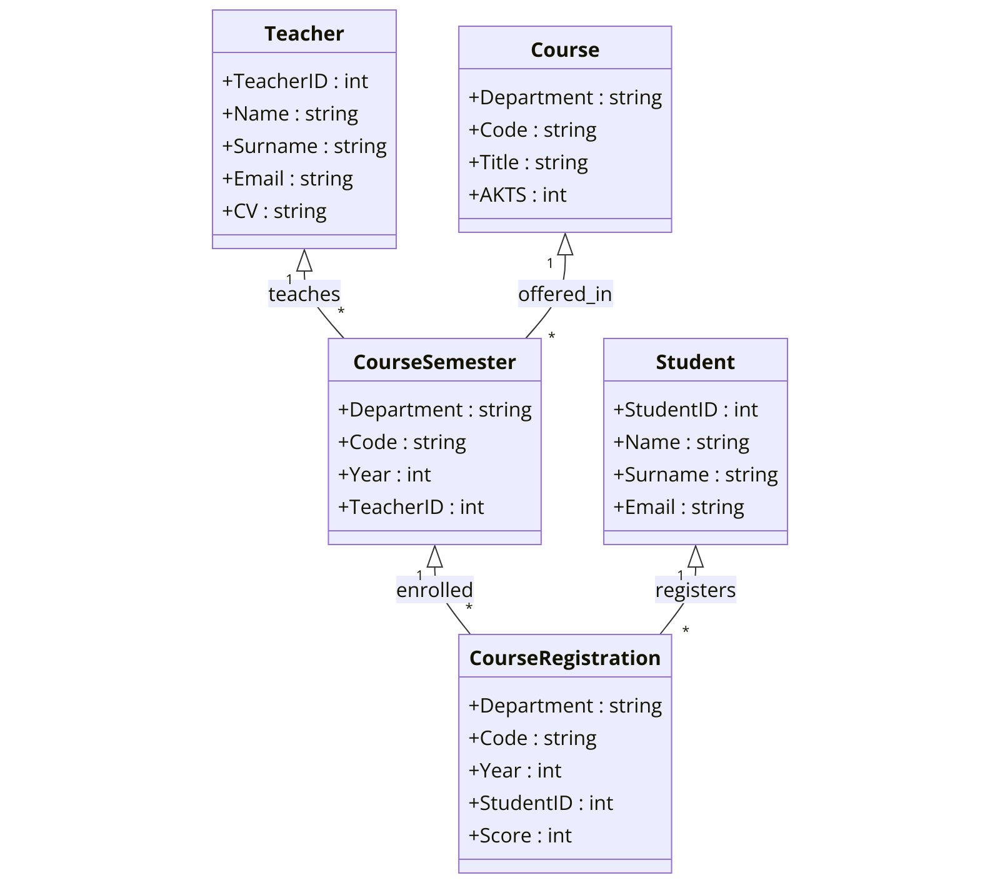


### Write SQL statements for the following questions. Each question has a num ber in parentheses. For full credit, you must provide that many substantially di erent SQL statements that would have the same result.

#### 4. List all student details. (2)- 10 points
```sql
SELECT * FROM Student;
SELECT StudentID, Name, Surname, Email FROM Student;
```
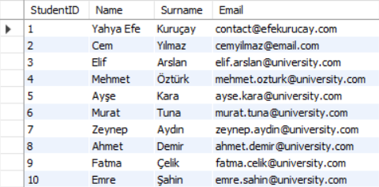

####  5. List all teacher names and surnames. (1)- 5 points

```sql
SELECT Name, Surname FROM Teacher;
```
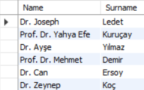

#### 6. List the department and codes of all courses offered in 2025. (2)- 10 points
```sql
SELECT Department, Code FROM CourseSemester WHERE Year = 2025;
SELECT DISTINCT Department, Code FROM CourseSemester WHERE Year = 2025;
```
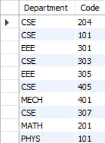
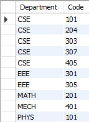
#### 7. List all course titles that contain the word database and are o ered in 2025. (2)- 10 points
```sql
SELECT Title FROM Course WHERE Title LIKE '%database%' AND Code IN (SELECT Code FROM CourseSemester WHERE Year = 2025);
SELECT c.Title FROM Course c JOIN CourseSemester cs ON c.Code = cs.Code AND cs.Year = 2025 WHERE c.Title LIKE '%database%';
```

#### 8. List all book courses (department, code, title) that have no students registered. (1)- 5 points
```sql
SELECT c.Department, c.Code, c.Title FROM Course c LEFT JOIN CourseRegistration cr ON c.Code = cr.Code WHERE cr.StudentID IS NULL;
```
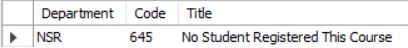
#### 9. Remove all courses that have not been offered since 2020 from teh database. (1)- 5 points
```sql
DELETE FROM Course WHERE Code NOT IN (SELECT Code FROM CourseSemester WHERE Year >= 2020);
```

#### 10. List course department and code along with how many students area in each course? (1)- 5 points
```sql
SELECT Department, Code, COUNT(StudentID) AS StudentCount FROM CourseRegistration GROUP BY Department, Code;
```
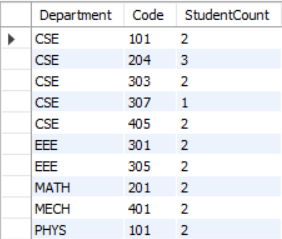
####  11. How many courses are being taught by Joseph Ledet in 2025? (1)- 5 points
```sql
SELECT COUNT(*) FROM CourseSemester WHERE TeacherID = (SELECT TeacherID FROM Teacher WHERE Name = 'Dr. Joseph' AND Surname = 'Ledet') AND Year = 2025;
```
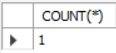
####  12. List the names of students who are not registered for any courses. (1)- 5 points

```sql
SELECT Name FROM Student WHERE StudentID NOT IN (SELECT StudentID FROM CourseRegistration);
```

#### 13. Give a list of students who are currently taking more than 30 AKTS and also list which courses they are registered for. (1)- 5 points
```sql
SELECT s.StudentID, s.Name, s.Surname, SUM(c.AKTS) AS Total_AKTS
FROM Student s 
JOIN CourseRegistration cr ON s.StudentID = cr.StudentID 
JOIN Course c ON cr.Code = c.Code 
GROUP BY s.StudentID
HAVING Total_AKTS > 30;

```
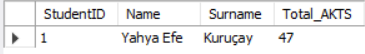
####  14. Assume you are registered for CSE 204 in 2025. Change your score for that course to be 100? (1)- 5 points
```sql
UPDATE CourseRegistration SET Score = 100 WHERE Code = 'CSE204' AND Year = 2025 AND StudentID = (SELECT StudentID FROM Student WHERE Email = 'contact@efekurucay.com');
```
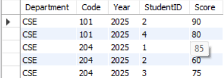
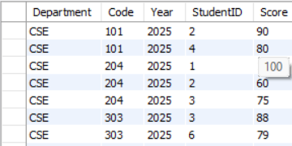
####  15. List the courses that are being taken by a student with email address cemyilmaz@email.com (1)- 5 points
```sql
SELECT c.Department, c.Code, c.Title FROM Course c JOIN CourseRegistration cr ON c.Code = cr.Code JOIN Student s ON cr.StudentID = s.StudentID WHERE s.Email = 'cemyilmaz@email.com';
```
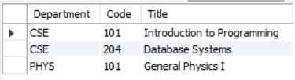
#### 16. For each course that has been offered at least 5 times, list the teachers who have taught them. (1)- 10 points
```sql
SELECT t.Name, t.Surname
FROM Teacher t
JOIN CourseSemester cs ON t.TeacherID = cs.TeacherID
GROUP BY cs.Code, t.TeacherID
HAVING COUNT(cs.Year) >= 5;

```
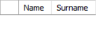
####  17. List student names, surnames and total AKTS for 2025 for each student. (1)- 5 points
```sql
SELECT s.Name, s.Surname, SUM(c.AKTS) AS Total_AKTS FROM Student s JOIN CourseRegistration cr ON s.StudentID = cr.StudentID JOIN Course c ON c.Code = cr.Code WHERE cr.Year = 2025 GROUP BY s.StudentID;
```
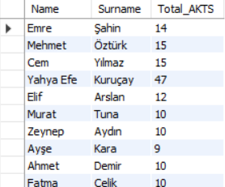
#### 18. There could be additional columns on these tables. Use SQL to add columns to two di erent tables that would seem reasonable. (2)- 10 points
```sql
ALTER TABLE Teacher ADD COLUMN Office VARCHAR(50);
ALTER TABLE Student ADD COLUMN DateOfBirth DATE;
```
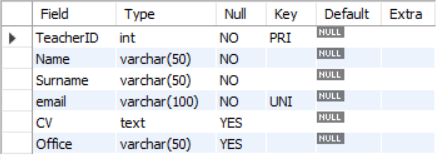
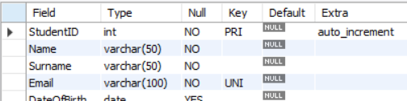
---
I also have included the MySQL Workbench history output for your review
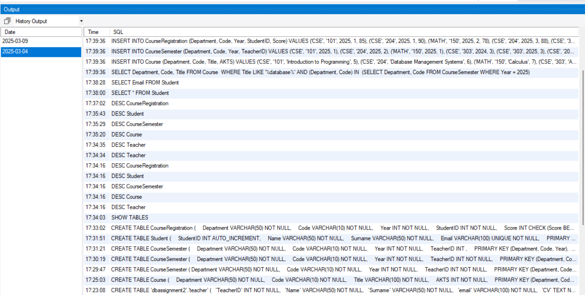
