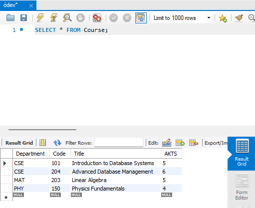
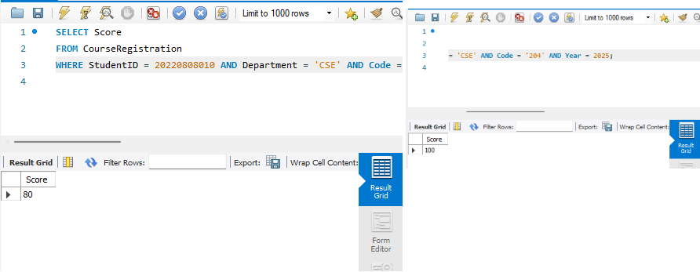

# CSE 204 - SQL Assignment 2

## **1. Database and Table Creation**

### **1.1. Create Database**
```sql
CREATE DATABASE LibraryDB;
USE LibraryDB;
```

### **1.2. Create Tables**
#### **1.2.1. Teacher Table**
```sql
CREATE TABLE Teacher (
    TeacherID INT AUTO_INCREMENT PRIMARY KEY,
    Name VARCHAR(50) NOT NULL,
    Surname VARCHAR(50) NOT NULL,
    Email VARCHAR(100) UNIQUE NOT NULL,
    CV TEXT
);
```

#### **1.2.2. Course Table**
```sql
CREATE TABLE Course (
    Department VARCHAR(10),
    Code VARCHAR(10),
    Title VARCHAR(100) NOT NULL,
    AKTS INT NOT NULL,
    PRIMARY KEY (Department, Code)
);
```

#### **1.2.3. CourseSemester Table**
```sql
CREATE TABLE CourseSemester (
    Department VARCHAR(10),
    Code VARCHAR(10),
    Year INT NOT NULL,
    TeacherID INT,
    PRIMARY KEY (Department, Code, Year),
    FOREIGN KEY (TeacherID) REFERENCES Teacher(TeacherID) ON DELETE SET NULL
);
```

#### **1.2.4. Student Table**
```sql
CREATE TABLE Student (
    StudentID INT AUTO_INCREMENT PRIMARY KEY,
    Name VARCHAR(50) NOT NULL,
    Surname VARCHAR(50) NOT NULL,
    Email VARCHAR(100) UNIQUE NOT NULL
);
```

#### **1.2.5. CourseRegistration Table**
```sql
CREATE TABLE CourseRegistration (
    Department VARCHAR(10),
    Code VARCHAR(10),
    Year INT NOT NULL,
    StudentID INT NOT NULL,
    Score INT CHECK (Score BETWEEN 0 AND 100),
    PRIMARY KEY (Department, Code, Year, StudentID),
    FOREIGN KEY (StudentID) REFERENCES Student(StudentID) ON DELETE CASCADE
);
```


---

## **2. Dependency Order Explanation**
```markdown
1. `Teacher` table must be created before `CourseSemester` because `CourseSemester` contains a `TeacherID` foreign key.
2. `Student` table must be created before `CourseRegistration` because `CourseRegistration` references `StudentID`.
```

---

## **3. Creating CourseSemester Before Teacher Table**
```sql
CREATE TABLE CourseSemester (
    Department VARCHAR(10),
    Code VARCHAR(10),
    Year INT NOT NULL,
    PRIMARY KEY (Department, Code, Year)
);

ALTER TABLE CourseSemester ADD COLUMN TeacherID INT;
ALTER TABLE CourseSemester ADD FOREIGN KEY (TeacherID) REFERENCES Teacher(TeacherID);
```


## **4. List all students**
```sql
SELECT * FROM Student;


```


## **5. List all teacher names and surnames**
```sql
SELECT Name, Surname FROM Teacher;
```


## **6. List departments and codes of courses offered in 2025**
```sql
SELECT Department, Code FROM CourseSemester WHERE Year = 2025;
```


## **7. List course titles containing 'database' in 2025**
```sql
SELECT Title FROM Course 
WHERE Title LIKE '%database%' 
AND (Department, Code) IN (SELECT Department, Code FROM CourseSemester WHERE Year = 2025);
```


## **8. List courses with no student registrations**
```sql
SELECT c.Department, c.Code, c.Title
FROM Course c
LEFT JOIN CourseRegistration cr ON c.Department = cr.Department AND c.Code = cr.Code
WHERE cr.StudentID IS NULL;
```


## **9. Remove courses not offered since 2020**

### **1️⃣ List Courses Not Offered Since 2020**
```sql
SELECT DISTINCT c.Department, c.Code, c.Title
FROM Course c
LEFT JOIN CourseSemester cs ON c.Department = cs.Department AND c.Code = cs.Code
WHERE cs.Year <= 2020 OR cs.Year IS NULL;
```
📌 **This query lists courses that have not been offered since 2020 or have never been offered.**


---

### **2️⃣ Delete Courses Not Offered Since 2020**
```sql
DELETE FROM Course
WHERE (Department, Code) NOT IN (
    SELECT DISTINCT Department, Code FROM CourseSemester WHERE Year > 2020
);
```
📌 **This query removes all courses from the `Course` table that have not been offered since 2020.**

---

### **3️⃣ Verify Remaining Courses After Deletion**
```sql
SELECT * FROM Course;
```
📌 **Run this query to check which courses remain after deletion.**

---




## **10. Count students per course**
```sql
SELECT Department, Code, COUNT(StudentID) AS StudentCount
FROM CourseRegistration
GROUP BY Department, Code;
```


## **11. Count courses taught by Joseph Ledet in 2025**
```sql
SELECT COUNT(*) 
FROM CourseSemester cs
JOIN Teacher t ON cs.TeacherID = t.TeacherID
WHERE t.Name = 'Joseph' AND t.Surname = 'Ledet' AND cs.Year = 2025;
```

## **12. List students who are not registered for any course**
```sql
SELECT s.Name, s.Surname
FROM Student s
LEFT JOIN CourseRegistration cr ON s.StudentID = cr.StudentID
WHERE cr.StudentID IS NULL;
```


## **13. List students taking more than 30 AKTS**
```sql
SELECT cr.StudentID, s.Name, s.Surname, c.Title, SUM(c.AKTS) AS TotalAKTS
FROM CourseRegistration cr
JOIN Course c ON cr.Department = c.Department AND cr.Code = c.Code
JOIN Student s ON cr.StudentID = s.StudentID
GROUP BY cr.StudentID, s.Name, s.Surname, c.Title
HAVING SUM(c.AKTS) > 30;
```


## **14. Update score for a specific student**
```sql
UPDATE CourseRegistration
SET Score = 100
WHERE StudentID = (SELECT StudentID FROM Student WHERE Email = 'your@email.com')
AND Department = 'CSE' AND Code = '204' AND Year = 2025;
```


## **15. List courses taken by 'cemyilmaz@email.com'**
```sql
SELECT c.Department, c.Code, c.Title
FROM CourseRegistration cr
JOIN Course c ON cr.Department = c.Department AND cr.Code = c.Code
JOIN Student s ON cr.StudentID = s.StudentID
WHERE s.Email = 'cemyilmaz@email.com';
```


## **16. List teachers who taught a course offered at least 5 times**
```sql
SELECT cs.Department, cs.Code, t.Name, t.Surname
FROM CourseSemester cs
JOIN Teacher t ON cs.TeacherID = t.TeacherID
WHERE (cs.Department, cs.Code) IN (
    SELECT Department, Code 
    FROM CourseSemester 
    GROUP BY Department, Code 
    HAVING COUNT(Year) >= 5
);
```

## **17. List student names, surnames, and total AKTS for 2025**
```sql
SELECT s.Name, s.Surname, SUM(c.AKTS) AS TotalAKTS
FROM Student s
JOIN CourseRegistration cr ON s.StudentID = cr.StudentID
JOIN Course c ON cr.Department = c.Department AND cr.Code = c.Code
WHERE cr.Year = 2025
GROUP BY s.StudentID, s.Name, s.Surname;
```


## **18. Alter tables by adding new columns**
```sql
ALTER TABLE Student ADD COLUMN PhoneNumber VARCHAR(20);
ALTER TABLE Course ADD COLUMN Prerequisite VARCHAR(20);
